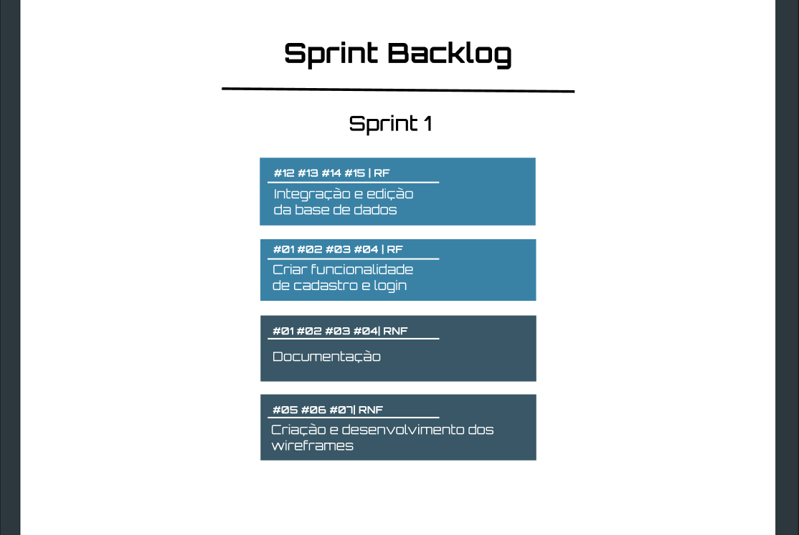

<h1 align="center">  Da Vinci Care</h1>

    <a href="#sobre">Sobre</a>  |  
    <a href="#objetivo">Objetivo da sprint</a>  |  
    <a href="#entregas">Entregas</a> | 
     <a href="#modelagem">Modelagem de dados</a> | 
    <a href="#burndown">Burndown</a> 

   

## 📑 Sobre o projeto

Para atender às necessidades dos usuários, sugerimos duas opções de dieta no aplicativo: uma personalizada, com ajuda de um profissional de saúde, e outra com dietas predefinidas para ganho de massa, perda de peso e manutenção.

As dietas serão adaptadas para diferentes faixas etárias.

O aplicativo terá funcionalidades como um checklist diário para marcar os alimentos consumidos, calcular automaticamente as calorias ingeridas e permitir a adição de novos alimentos.

Isso promoverá uma experiência melhor para o usuário, facilitando o acompanhamento de suas escolhas alimentares de forma precisa e personalizada.

> 🔗 Links gerais
>
> <ul>
> <li>Wireframe: <a href="https://www.figma.com/design/poSWkCqH6iSoVfVf667bXc/Healthcare-app-(Community)?node-id=0-1&node-type=canvas&t=EEpW8YOZNxuDcdQg-0">acesse aqui!</a></li>
> <li>Ferramenta de Gestão de Tarefas: <a href="https://daiwon.atlassian.net/jira/software/projects/SCRUM/boards/1">acesse aqui!</a></li>
> <li>Repositório do Back-End: <a href="https://github.com/Our-time-Fatec/API-2024_2-Back">acesse aqui!</a></li>
> <li>Repositório do Front-End: <a href="https://github.com/Our-time-Fatec/API-2024_2-Front">acesse aqui!</a></li>
> <li>Entrega do Back-End: <a href="https://github.com/Our-time-Fatec/API-2024_2-Back/releases/tag/sprint-01">acesse aqui!</a></li>
> <li>Entrega do Front-End: <a href="https://github.com/Our-time-Fatec/API-2024_2-Front/releases/tag/sprint-01">acesse aqui!</a></li>
> </ul>

 

    
## 💻 Tecnologias
#### 🖥️ Front-end

  
        

#### 🖥️ Back-end

  
        

 

 
## 🎯 Objetivos da Sprint

Os requisitos abrangidos por essa sprint são:
  

  

  
Nosso foco durante essa sprint foi entregar o usuário adicionar o consumo do alimento e checagem de alimentos num geral. As dietas são apenas mostradas para dar uma prévia de como vamos prosseguir na 2 sprint.

### 📃 Entregas

#### Tela inicial

#### Criação de usuário e login

 

#### Gestão de calorias e metas batidas ou não batidas

 

#### Perfil do usuário com suas informações

 

#### Listagem de alimentos

 

#### Cadastro de alimentos e listagem dos mesmos

 

#### Controle e listagem de alimentos consumidos

 

#### FAQ sobre as dietas

 

#### Controle e listagem de dietas (Exemplos de aplicações para a sprint 2)

 

### 🗂 Modelo de Dados

 

### 📉 Burndown:

  
> Instituição: Fatec Jacareí - Prof. Francisco de Moura
> 
> Curso: Desenvolvimento de Software Multiplataforma/4º Semestre
 
 

